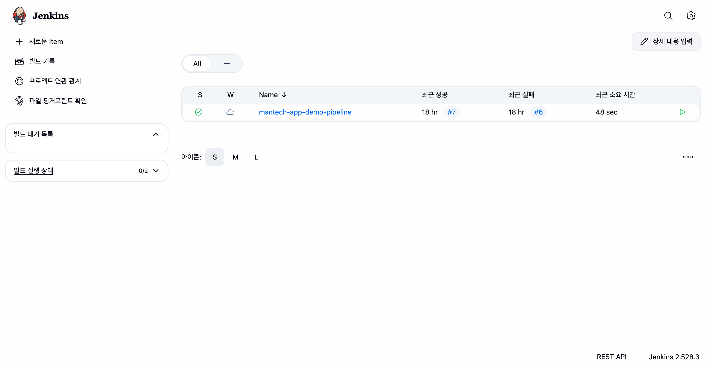

# mantech-app-demo

Spring Boot(Gradle) 애플리케이션을 Jenkins 파이프라인으로 빌드/테스트하고,  
Docker 이미지를 Docker Hub에 Push한 뒤, GitOps 레포(mantech-gitops-manifests)의 Kubernetes 매니페스트 이미지 태그를 자동 갱신하는 데모 레포입니다.

---

## 전체 흐름

1. Jenkins가 `mantech-app-demo` 체크아웃
2. Gradle로 **테스트 + bootJar 빌드**
3. Docker 이미지 빌드 및 태그 지정(커밋 SHA)
4. Docker Hub에 Push (`:<shortSha> 버전 이력용 태그`, `:latest`)
5. GitOps 레포를 clone → deployment의 `image:` 태그를 `<shortSha>`로 변경 → commit/push
6. Argo CD가 GitOps 레포 변경을 감지하여 Kubernetes에 반영(Sync)

---

## 주요 파일

- `Jenkinsfile` : 파이프라인 정의
- `app/` : Spring Boot 애플리케이션
- `jenkins/Dockerfile` : Jenkins 컨테이너 커스텀(도커/깃 설치, JDK 포함)
- `jenkins/docker-compose.yml` : 로컬 Jenkins 구동(docker.sock 마운트)

---

## Jenkins 로컬 실행 (Docker Compose)

예: `jenkins/docker-compose.yml`에서 다음 구성이 핵심입니다.

- Jenkins 홈 볼륨 마운트: `jenkins_home:/var/jenkins_home`
- Docker 소켓 마운트: `/var/run/docker.sock:/var/run/docker.sock`
  - Jenkins 컨테이너에서 `docker build / docker push`를 수행하기 위해 필요

```yaml
services:
  jenkins:
    build: .
    container_name: mantech-jenkins
    user: root
    ports:
      - '8081:8080'
      - '50000:50000'
    volumes:
      - jenkins_home:/var/jenkins_home
      - /var/run/docker.sock:/var/run/docker.sock
    environment:
      - JAVA_OPTS=-Djenkins.install.runSetupWizard=false

volumes:
  jenkins_home:
```

---

## Jenkins Docker 이미지(커스텀) 예시

JDK 21 기반 Jenkins 이미지 + docker/git 설치:

```dockerfile
FROM jenkins/jenkins:lts-jdk21
USER root
RUN apt-get update && apt-get install -y docker.io git && rm -rf /var/lib/apt/lists/*
```

---

## Jenkinsfile 주요 단계

일반적으로 아래 단계로 구성됩니다.

- Checkout
- Build JAR (Gradle)
- Build Docker Image
- Push to Docker Hub
- Update GitOps Manifest (image tag)

### 보안/안정성 포인트(실습에서 반영한 내용)

- **GitHub push 시 URL에 토큰을 직접 문자열로 끼워넣는 방식은 위험**
  - `GIT_ASKPASS`를 사용해 비대화식 인증으로 처리하면 로그에 노출 위험을 줄일 수 있음
- **`cleanWs()` 단계에서 실패**
  - 워크스페이스 클린업 플러그인이 없으면 `cleanWs()` DSL이 없어 실패할 수 있음
  - 플러그인 설치 대신 **내장 스텝인 `deleteDir()`**로 대체하여 해결 가능

---

## Jenkins Credentials 구성

### 1) Docker Hub

- **Type**: Username with password
- 예: `DOCKERHUB_CREDS`
- 파이프라인에서 `docker login`에 사용

### 2) GitHub Push (GitOps repo push)

- **Type**: Username with password (또는 PAT)
- 예: `GITHUB_PUSH`

---

## 트러블슈팅

### 1) Gradle Toolchain: Java 21 not found

**증상**

- `Cannot find a Java installation ... languageVersion=21`

**해결**

- Jenkins 실행 이미지가 JDK 21 포함 이미지인지 확인
  - 예: `jenkins/jenkins:lts-jdk21`

### 2) GitOps clone URL 오류 (Port number ... 0~65535)

**증상**

- `https://bravadosw@naver.com:****@github.com/...` 형태로 만들어져 URL이 깨짐

**원인**

- `user:token@` 형태 URL 구성 시 `@`/`:` 문자가 섞이면 URL 파싱이 꼬임

**해결**

- Credentials의 username을 **GitHub 아이디**로 변경
- 또는 `GIT_ASKPASS` 방식으로 인증 처리

---

```bash
kubectl -n mantech get all
kubectl -n mantech port-forward svc/<service-name> 8080:80
```



<center>
jenkins pipeline 결과 화면
</center>
